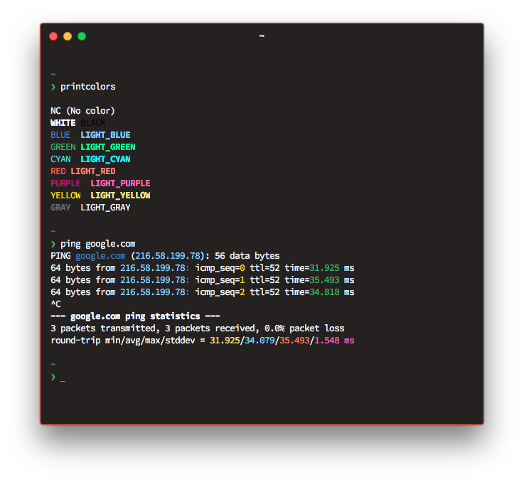

# Hyper Theme: Named CSS Colors



A Hyper theme based on named CSS colors (`black`, `tomato`, `mediumseagreen`, `gold`, `steelblue`, `mediumvioletred`, `mediumturquoise`, `whitesmoke`, `dimgray`, `salmon`, `mediumspringgreen`, `khaki`, `lightskyblue`, `hotpink`, `cyan`, `white`).

## Installation

```sh
hyper i hyper-named-css-colors
```
